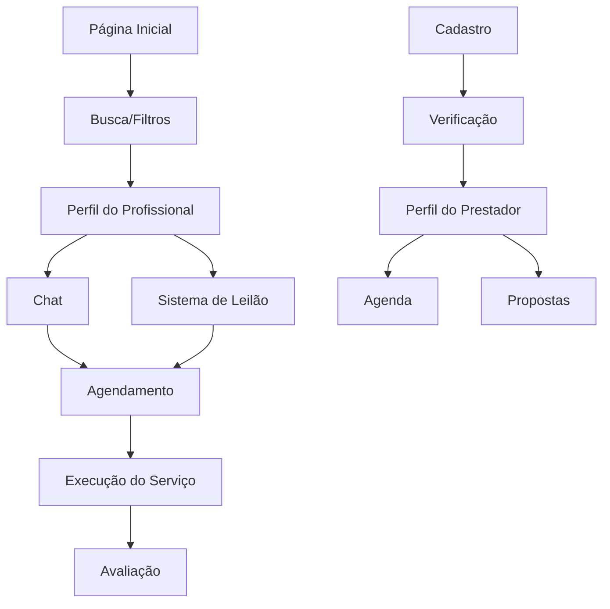

# Requisitos para Próximas Fases - App Garçom

## 1. Visão Geral do Projeto

O App Garçom é uma plataforma que conecta usuários finais (restaurantes, eventos, festas) com prestadores de serviços especializados em gastronomia e hospitalidade. O projeto já possui uma base sólida com React + TypeScript + Supabase, mas necessita de melhorias críticas na autenticação, sistema de chat em tempo real e expansão das funcionalidades core.

## 2. Funcionalidades Principais

### 2.1 Papéis de Usuário

| Papel | Método de Registro | Permissões Principais |
|-------|-------------------|----------------------|
| Cliente | Email/telefone | Buscar profissionais, agendar serviços, avaliar |
| Prestador | Email + validação de documentos | Gerenciar perfil, aceitar propostas, chat |
| Administrador | Convite interno | Moderar conteúdo, gerenciar usuários |

### 2.2 Módulos de Funcionalidade

Nossa plataforma consiste nas seguintes páginas principais:

1. **Página Inicial**: busca de profissionais, filtros avançados, categorias de serviços
2. **Perfil do Cliente**: dashboard, histórico de contratações, gestão de eventos
3. **Perfil do Prestador**: agenda, portfólio, certificações, propostas
4. **Sistema de Chat**: mensagens em tempo real, histórico de conversas
5. **Sistema de Leilão**: leilão reverso de serviços, propostas competitivas
6. **Autenticação**: login/registro multi-perfil, verificação de documentos
7. **Painel Admin**: moderação, relatórios, configurações da plataforma

### 2.3 Detalhes das Páginas

| Nome da Página | Nome do Módulo | Descrição da Funcionalidade |
|----------------|----------------|-----------------------------|
| Página Inicial | Busca de Profissionais | Filtrar por categoria, localização, disponibilidade e avaliação |
| Página Inicial | Grid de Categorias | Exibir categorias (Garçom, Chef, Bartender, etc.) com ícones |
| Página Inicial | Sistema de Filtros | Filtros por distância, disponibilidade, avaliação mínima |
| Perfil do Cliente | Dashboard | Visualizar agendamentos ativos, histórico, estatísticas |
| Perfil do Cliente | Gestão de Eventos | Criar, editar e gerenciar eventos e estabelecimentos |
| Perfil do Prestador | Perfil Profissional | Gerenciar dados pessoais, descrição, preços, fotos |
| Perfil do Prestador | Agenda de Disponibilidade | Definir horários disponíveis, bloquear datas |
| Perfil do Prestador | Gestão de Propostas | Visualizar, aceitar ou recusar propostas de trabalho |
| Sistema de Chat | Mensagens em Tempo Real | Enviar/receber mensagens instantâneas via Supabase Realtime |
| Sistema de Chat | Histórico de Conversas | Armazenar e recuperar histórico completo de mensagens |
| Sistema de Leilão | Leilão Reverso | Clientes postam demandas, prestadores fazem propostas |
| Sistema de Leilão | Timer de Lances | Contagem regressiva para fechamento de leilões |
| Autenticação | Login Multi-perfil | Autenticação diferenciada por tipo de usuário |
| Autenticação | Verificação de Documentos | Upload e validação de certificações para prestadores |
| Painel Admin | Moderação de Conteúdo | Aprovar/reprovar perfis, gerenciar denúncias |
| Painel Admin | Relatórios e Analytics | Dashboards com métricas de uso e performance |

## 3. Processo Principal

### Fluxo do Cliente
1. Cliente acessa a plataforma e busca profissionais por categoria/localização
2. Aplica filtros específicos (disponibilidade, preço, avaliação)
3. Visualiza perfis detalhados dos prestadores
4. Inicia conversa via chat ou cria leilão de serviço
5. Agenda serviço diretamente ou aceita proposta do leilão
6. Acompanha execução do serviço e avalia prestador

### Fluxo do Prestador
1. Prestador se cadastra e valida documentos/certificações
2. Configura perfil profissional com portfólio e preços
3. Define agenda de disponibilidade
4. Recebe notificações de leilões compatíveis com seu perfil
5. Faz propostas em leilões ou responde mensagens diretas
6. Executa serviços agendados e recebe avaliações

## 4. Design da Interface

### 4.1 Estilo de Design

- **Cores Primárias**: Cinza escuro (#1f2937) e branco (#ffffff)
- **Cores Secundárias**: Cinza claro (#f3f4f6) e azul accent (#3b82f6)
- **Estilo dos Botões**: Arredondados com sombras suaves
- **Fonte**: Inter ou system fonts, tamanhos 14px-24px
- **Layout**: Card-based com navegação superior
- **Ícones**: Lucide React com estilo minimalista

### 4.2 Visão Geral do Design das Páginas

| Nome da Página | Nome do Módulo | Elementos da UI |
|----------------|----------------|----------------|
| Página Inicial | Barra de Busca | Input com ícone de busca, placeholder descritivo, botão de filtros |
| Página Inicial | Grid de Profissionais | Cards com foto, nome, categoria, avaliação, preço, botão de contato |
| Página Inicial | Filtros Modais | Modal overlay com sliders, checkboxes, botões de aplicar/limpar |
| Perfil do Cliente | Dashboard | Cards de estatísticas, gráficos simples, lista de agendamentos |
| Perfil do Prestador | Formulário de Perfil | Inputs organizados em seções, upload de imagens, toggle switches |
| Sistema de Chat | Interface de Mensagens | Lista de conversas à esquerda, área de mensagens à direita, input de texto |
| Sistema de Leilão | Cards de Leilão | Timer visual, descrição do serviço, área de propostas, botões de ação |
| Autenticação | Formulários | Inputs com validação visual, botões CTA destacados, links secundários |

### 4.3 Responsividade

A aplicação é mobile-first com adaptação para desktop. Inclui otimização para touch em dispositivos móveis e navegação por teclado em desktop.

## 5. Próximas Ações Prioritárias

### Fase 1: Verificação e Configuração do Banco (1-2 dias)
- Verificar se as migrations do Supabase foram executadas corretamente
- Testar conexão real com dados do banco
- Executar seed-data.sql se necessário
- Configurar Row Level Security (RLS) adequadamente

### Fase 2: Sistema de Autenticação Multi-perfil (2-3 dias)
- Implementar hook useAuth com gestão de sessão
- Criar páginas de login/registro diferenciadas por tipo de usuário
- Implementar proteção de rotas baseada em roles
- Sistema de verificação de documentos para prestadores

### Fase 3: Chat em Tempo Real (3-4 dias)
- Configurar Supabase Realtime para mensagens
- Implementar hook useChat com subscriptions
- Criar interface de chat responsiva
- Sistema de notificações de mensagens

### Fase 4: Sistema de Leilão de Serviços (4-5 dias)
- Implementar lógica de leilão reverso
- Sistema de propostas competitivas
- Timer em tempo real para leilões
- Notificações automáticas para prestadores compatíveis

### Fase 5: Expansão e Polimento (5-7 dias)
- Sistema de pagamentos (Stripe/Mercado Pago)
- Painel administrativo completo
- Sistema de avaliações e reviews
- Otimizações de performance e UX