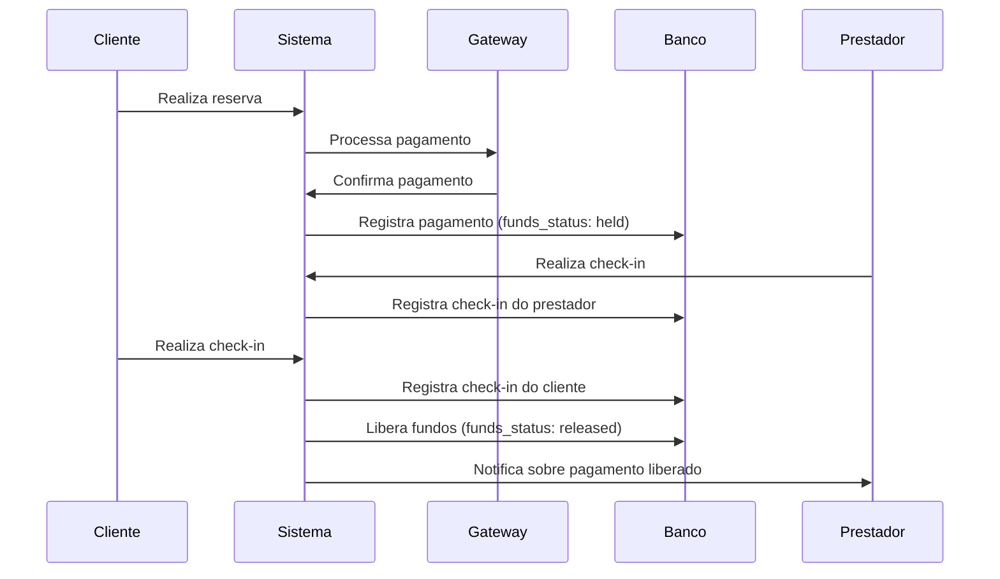

# Fluxo de Pagamento Antecipado com Retenção

## Visão Geral

O sistema implementa um fluxo de pagamento onde o contratante paga no momento do chamado, mas o dinheiro é retido até a conclusão do serviço. O pagamento só é liberado após o check-in tanto do prestador quanto do contratante no aplicativo.

## Estrutura de Comissões

- **Plataforma**: 15% do valor total
- **Prestador**: 85% do valor total

## Fluxo Detalhado

1. **Pagamento Antecipado**
   - O contratante realiza o pagamento no momento da reserva
   - O pagamento é processado pelo gateway (Mercado Pago ou Bitcoin)
   - O status do pagamento é definido como `pending` inicialmente
   - Os fundos são marcados como `held` (retidos)

2. **Prestação do Serviço**
   - O prestador comparece ao local e realiza o check-in no aplicativo
   - O cliente confirma a presença do prestador fazendo seu próprio check-in

3. **Liberação do Pagamento**
   - Quando ambos (prestador e cliente) realizaram o check-in, o sistema automaticamente:
     - Atualiza o status dos fundos para `released` (liberados)
     - Registra o timestamp da confirmação do serviço

4. **Avaliação da Experiência**
   - Após a conclusão do serviço, ambas as partes podem avaliar a experiência
   - As avaliações são registradas e afetam o rating do prestador

## Funções Principais

### `processPayment`
Processa o pagamento inicial, marcando-o como pagamento antecipado com fundos retidos.

### `registerProviderCheckIn`
Registra o check-in do prestador no local do serviço.

### `registerClientCheckIn`
Registra o check-in do cliente e, se o prestador já tiver feito check-in, libera os fundos retidos.

### `checkServiceConfirmation`
Verifica se ambas as partes confirmaram o serviço através do check-in.

## Campos do Banco de Dados

### Tabela `payments`
- `is_advance_payment`: Indica se é um pagamento antecipado
- `funds_status`: Status dos fundos (`held` ou `released`)
- `service_confirmed_at`: Timestamp da confirmação do serviço

### Tabela `bookings`
- `provider_checked_in`: Indica se o prestador fez check-in
- `client_checked_in`: Indica se o cliente fez check-in
- `provider_checkin_time`: Timestamp do check-in do prestador
- `client_checkin_time`: Timestamp do check-in do cliente

## Fluxo de Implementação

