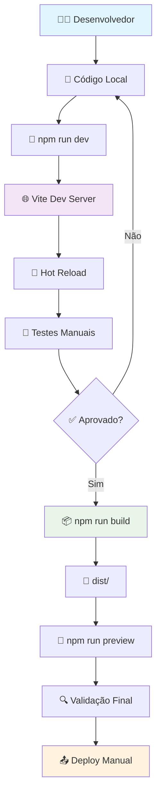
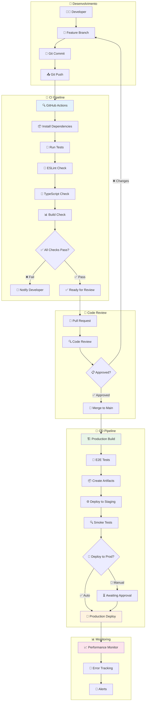
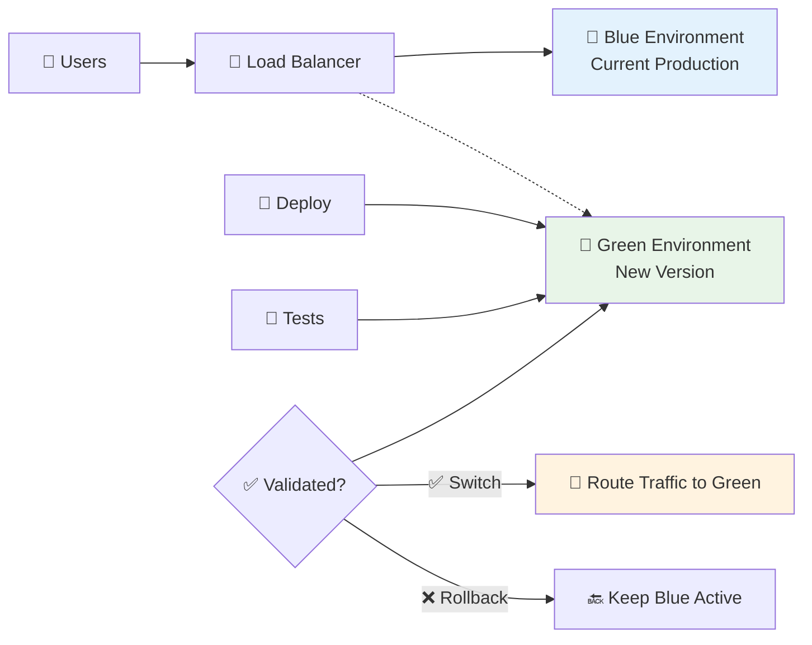

# Pipeline de Desenvolvimento - App Garçom

## 🚀 Diagrama de Pipeline CI/CD

### 1. **Fluxo de Desenvolvimento Atual**



### 2. **Pipeline Proposto (CI/CD Automatizado)**



### 3. **Estrutura de Branches Recomendada**

```mermaid
gitgraph
    commit id: "Initial"
    branch develop
    checkout develop
    commit id: "Setup"
    
    branch feature/auth
    checkout feature/auth
    commit id: "Auth logic"
    commit id: "Auth tests"
    
    checkout develop
    merge feature/auth
    commit id: "Merge auth"
    
    branch feature/payments
    checkout feature/payments
    commit id: "Payment integration"
    commit id: "Payment tests"
    
    checkout develop
    merge feature/payments
    commit id: "Merge payments"
    
    checkout main
    merge develop
    commit id: "Release v1.0"
    
    checkout develop
    branch hotfix/critical-bug
    checkout hotfix/critical-bug
    commit id: "Fix bug"
    
    checkout main
    merge hotfix/critical-bug
    commit id: "Hotfix v1.0.1"
    
    checkout develop
    merge hotfix/critical-bug
```

## ⚙️ Configuração de CI/CD

### **GitHub Actions Workflow**

```yaml
# .github/workflows/ci-cd.yml
name: CI/CD Pipeline

on:
  push:
    branches: [ main, develop ]
  pull_request:
    branches: [ main, develop ]

jobs:
  test:
    runs-on: ubuntu-latest
    
    steps:
    - name: 📥 Checkout code
      uses: actions/checkout@v4
      
    - name: 📦 Setup Node.js
      uses: actions/setup-node@v4
      with:
        node-version: '18'
        cache: 'npm'
        
    - name: 📦 Install dependencies
      run: npm ci
      
    - name: 🧪 Run tests
      run: npm run test
      
    - name: 🔧 ESLint check
      run: npm run lint
      
    - name: 🎨 TypeScript check
      run: npm run type-check
      
    - name: 🏗️ Build check
      run: npm run build

  deploy-staging:
    needs: test
    runs-on: ubuntu-latest
    if: github.ref == 'refs/heads/develop'
    
    steps:
    - name: 📥 Checkout code
      uses: actions/checkout@v4
      
    - name: 📦 Setup Node.js
      uses: actions/setup-node@v4
      with:
        node-version: '18'
        cache: 'npm'
        
    - name: 📦 Install dependencies
      run: npm ci
      
    - name: 🏗️ Build for staging
      run: npm run build
      env:
        VITE_SUPABASE_URL: ${{ secrets.STAGING_SUPABASE_URL }}
        VITE_SUPABASE_ANON_KEY: ${{ secrets.STAGING_SUPABASE_ANON_KEY }}
        VITE_MP_ACCESS_TOKEN: ${{ secrets.STAGING_MP_ACCESS_TOKEN }}
        
    - name: 🚀 Deploy to Staging
      run: |
        # Deploy to staging environment
        # (Vercel, Netlify, or custom server)
        
  deploy-production:
    needs: test
    runs-on: ubuntu-latest
    if: github.ref == 'refs/heads/main'
    
    steps:
    - name: 📥 Checkout code
      uses: actions/checkout@v4
      
    - name: 📦 Setup Node.js
      uses: actions/setup-node@v4
      with:
        node-version: '18'
        cache: 'npm'
        
    - name: 📦 Install dependencies
      run: npm ci
      
    - name: 🏗️ Build for production
      run: npm run build
      env:
        VITE_SUPABASE_URL: ${{ secrets.PROD_SUPABASE_URL }}
        VITE_SUPABASE_ANON_KEY: ${{ secrets.PROD_SUPABASE_ANON_KEY }}
        VITE_MP_ACCESS_TOKEN: ${{ secrets.PROD_MP_ACCESS_TOKEN }}
        
    - name: 🧪 Run E2E tests
      run: npm run test:e2e
      
    - name: 🚀 Deploy to Production
      run: |
        # Deploy to production environment
        # (Vercel, Netlify, or custom server)
        
    - name: 📊 Performance audit
      run: npm run lighthouse
```

### **Scripts de Package.json Recomendados**

```json
{
  "scripts": {
    "dev": "vite",
    "build": "tsc && vite build",
    "preview": "vite preview",
    "lint": "eslint . --ext ts,tsx --report-unused-disable-directives --max-warnings 0",
    "lint:fix": "eslint . --ext ts,tsx --fix",
    "type-check": "tsc --noEmit",
    "test": "vitest",
    "test:ui": "vitest --ui",
    "test:coverage": "vitest --coverage",
    "test:e2e": "playwright test",
    "lighthouse": "lighthouse-ci autorun",
    "prepare": "husky install",
    "pre-commit": "lint-staged"
  }
}
```

## 🏗️ Ambientes de Deploy

### **1. Desenvolvimento Local**
```bash
# Configuração local
npm install
npm run dev

# Variáveis de ambiente (.env.local)
VITE_SUPABASE_URL=http://localhost:54321
VITE_SUPABASE_ANON_KEY=local_key
VITE_MP_ACCESS_TOKEN=test_token
```

### **2. Staging Environment**
```bash
# Deploy automático via GitHub Actions
# Branch: develop
# URL: https://app-garcom-staging.vercel.app

# Variáveis de ambiente
VITE_SUPABASE_URL=https://staging-project.supabase.co
VITE_SUPABASE_ANON_KEY=staging_anon_key
VITE_MP_ACCESS_TOKEN=staging_mp_token
```

### **3. Production Environment**
```bash
# Deploy automático via GitHub Actions
# Branch: main
# URL: https://app-garcom.vercel.app

# Variáveis de ambiente
VITE_SUPABASE_URL=https://rtcafnmyuybhxkcxkrzz.supabase.co
VITE_SUPABASE_ANON_KEY=production_anon_key
VITE_MP_ACCESS_TOKEN=production_mp_token
```

## 🔧 Ferramentas de Qualidade

### **ESLint Configuration**
```javascript
// eslint.config.js
export default [
  {
    files: ['**/*.{ts,tsx}'],
    rules: {
      '@typescript-eslint/no-unused-vars': 'error',
      '@typescript-eslint/no-explicit-any': 'warn',
      'react-hooks/exhaustive-deps': 'error',
      'react/prop-types': 'off'
    }
  }
];
```

### **Husky Pre-commit Hooks**
```bash
# .husky/pre-commit
#!/usr/bin/env sh
. "$(dirname -- "$0")/_/husky.sh"

npm run lint
npm run type-check
npm run test
```

### **Lint-staged Configuration**
```json
{
  "lint-staged": {
    "*.{ts,tsx}": [
      "eslint --fix",
      "prettier --write"
    ],
    "*.{json,md}": [
      "prettier --write"
    ]
  }
}
```

## 📊 Monitoramento e Métricas

### **Performance Monitoring**
```javascript
// src/lib/monitoring.ts
import { getCLS, getFID, getFCP, getLCP, getTTFB } from 'web-vitals';

// Enviar métricas para analytics
function sendToAnalytics(metric) {
  // Implementar envio para Google Analytics, Sentry, etc.
  console.log(metric);
}

getCLS(sendToAnalytics);
getFID(sendToAnalytics);
getFCP(sendToAnalytics);
getLCP(sendToAnalytics);
getTTFB(sendToAnalytics);
```

### **Error Tracking**
```javascript
// src/lib/errorTracking.ts
import * as Sentry from '@sentry/react';

Sentry.init({
  dsn: import.meta.env.VITE_SENTRY_DSN,
  environment: import.meta.env.MODE,
  tracesSampleRate: 1.0,
});

export default Sentry;
```

## 🚀 Estratégia de Deploy

### **Deployment Checklist**
- [ ] ✅ Todos os testes passando
- [ ] 🔧 ESLint sem erros
- [ ] 🎨 TypeScript sem erros
- [ ] 📦 Build bem-sucedido
- [ ] 🧪 Testes E2E passando
- [ ] 🔒 Variáveis de ambiente configuradas
- [ ] 📊 Performance audit aprovado
- [ ] 🔍 Security scan limpo

### **Rollback Strategy**
```bash
# Em caso de problemas em produção
git revert <commit-hash>
git push origin main

# Ou deploy da versão anterior
git checkout <previous-tag>
npm run build
npm run deploy
```

### **Blue-Green Deployment**


---

## 📅 Controle de Versão

**📆 Última Atualização:** 15 de Janeiro de 2025  
**👤 Atualizado por:** Agente Técnico Especializado  
**📝 Versão:** 1.0  

> **⚠️ IMPORTANTE:** Sempre que modificar este documento, atualize a data acima e registre as principais alterações realizadas.

### 📋 Histórico de Alterações

| Data | Versão | Alterações | Responsável |
|------|--------|------------|-------------|
| 15/01/2025 | 1.0 | Criação inicial do pipeline CI/CD e documentação completa | Agente Técnico |

---

*Projeto: App Garçom - Plataforma de Serviços*