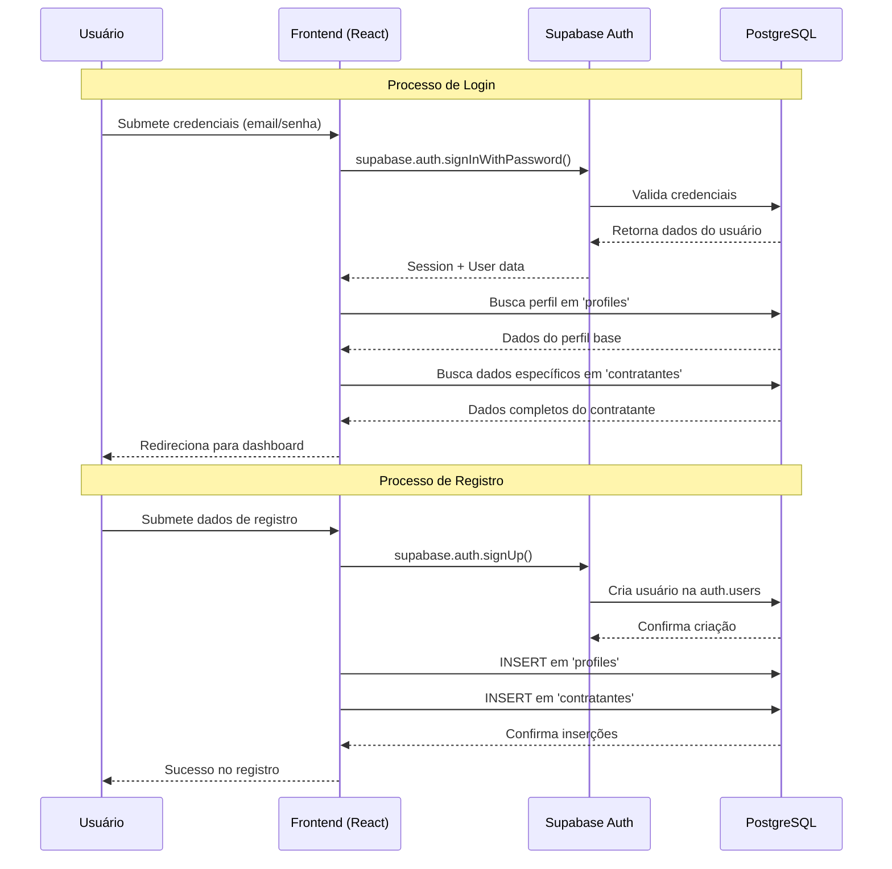
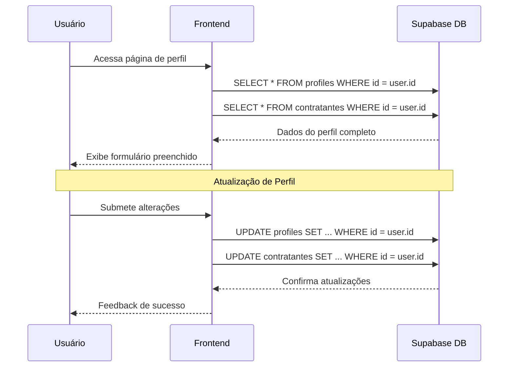
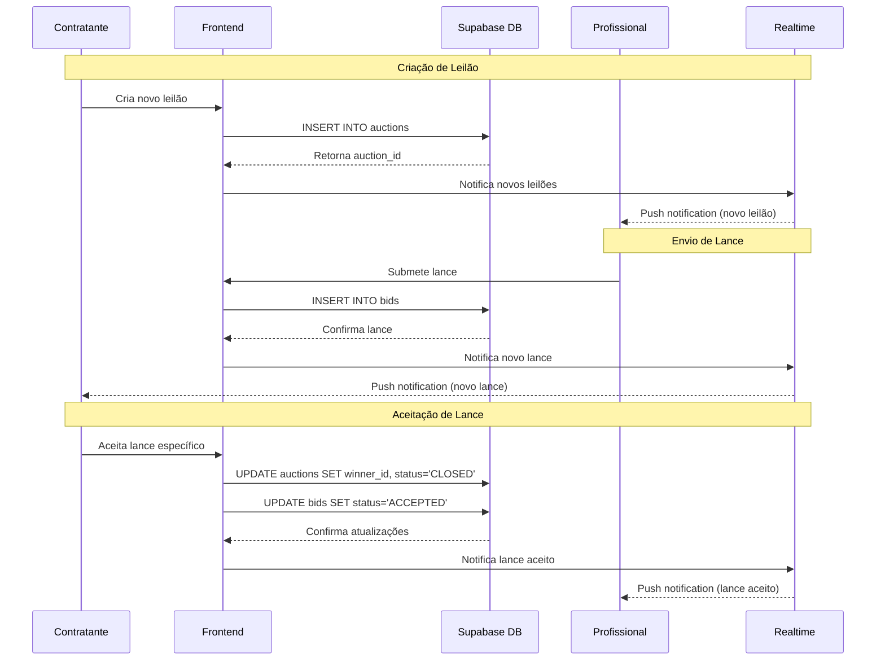
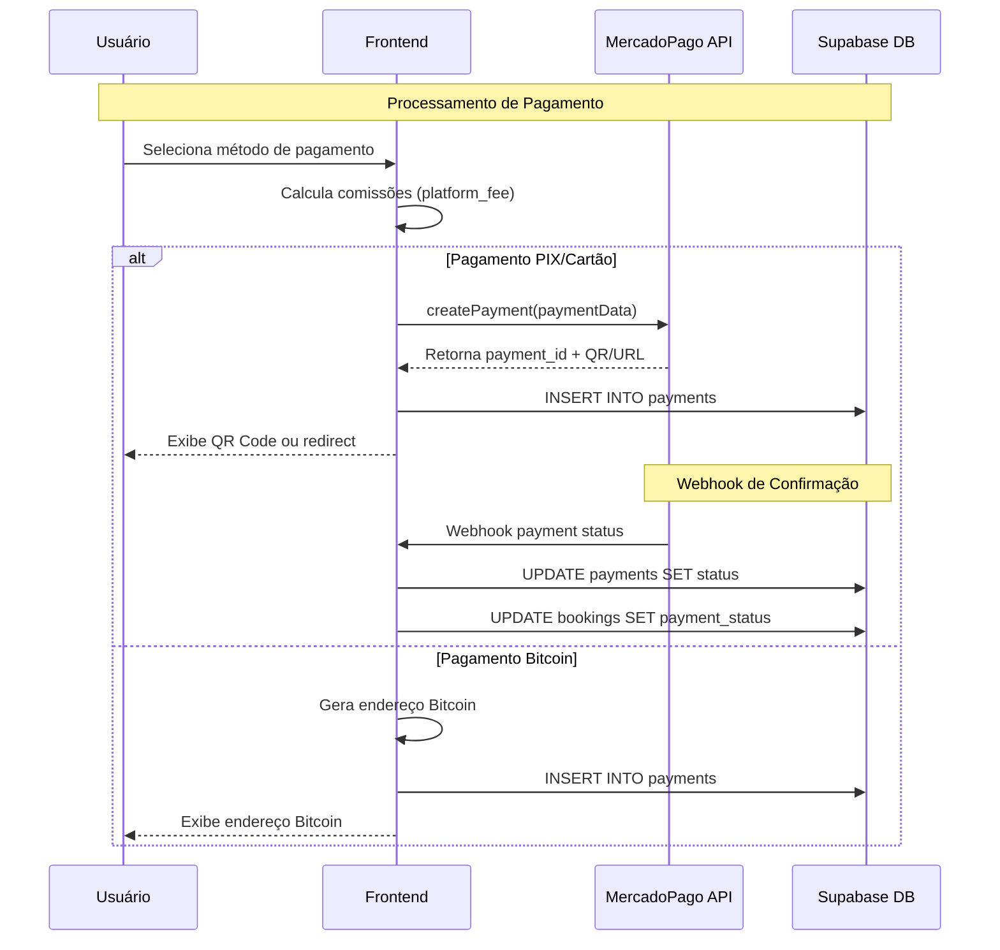
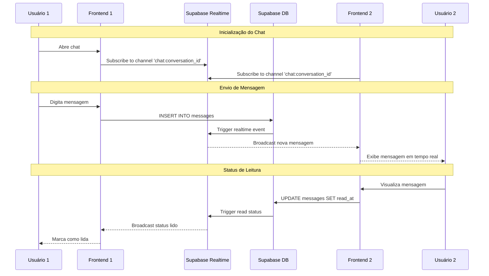

# Diagrama de Requisições - App Garçom

## 🔄 Fluxo de Requisições da Aplicação

### 1. **Fluxo de Autenticação**



### 2. **Fluxo de Gestão de Perfil**



### 3. **Fluxo do Sistema de Leilões**



### 4. **Fluxo de Pagamentos**



### 5. **Fluxo de Chat em Tempo Real**



## 🔗 Endpoints e APIs Utilizadas

### **Supabase Database Endpoints**
```
Base URL: https://rtcafnmyuybhxkcxkrzz.supabase.co/rest/v1/

Tabelas principais:
- /profiles (GET, POST, PATCH)
- /contratantes (GET, POST, PATCH)
- /auctions (GET, POST, PATCH)
- /bids (GET, POST, PATCH)
- /payments (GET, POST, PATCH)
- /messages (GET, POST, PATCH)
- /bookings (GET, POST, PATCH)
```

### **Supabase Auth Endpoints**
```
Base URL: https://rtcafnmyuybhxkcxkrzz.supabase.co/auth/v1/

Endpoints:
- /signup (POST)
- /token?grant_type=password (POST)
- /logout (POST)
- /recover (POST)
- /user (GET, PUT)
```

### **MercadoPago API**
```
Base URL: https://api.mercadopago.com/

Endpoints utilizados:
- /v1/payments (POST) - Criar pagamento
- /v1/payments/{id} (GET) - Status do pagamento
```

### **Supabase Realtime**
```
WebSocket URL: wss://rtcafnmyuybhxkcxkrzz.supabase.co/realtime/v1/websocket

Channels:
- realtime:public:messages
- realtime:public:auctions
- realtime:public:bids
```

## 📊 Métricas de Performance

### **Tempos de Resposta Esperados**
- **Autenticação:** < 2s
- **Carregamento de perfil:** < 1s
- **Criação de leilão:** < 3s
- **Envio de lance:** < 2s
- **Processamento de pagamento:** < 5s
- **Mensagens em tempo real:** < 500ms

### **Limites de Rate Limiting**
- **Supabase:** 100 req/min por IP
- **MercadoPago:** 1000 req/min por access_token
- **Realtime:** 100 conexões simultâneas

## 🔒 Segurança e Autenticação

### **Row Level Security (RLS) Policies**
```sql
-- Profiles: usuários só veem seus próprios dados
CREATE POLICY "select_own_profile" ON profiles FOR SELECT
USING (id = auth.uid());

-- Auctions: todos podem ver, só criador pode editar
CREATE POLICY "view_all_auctions" ON auctions FOR SELECT
TO authenticated USING (true);

CREATE POLICY "update_own_auctions" ON auctions FOR UPDATE
USING (created_by = auth.uid());

-- Bids: todos podem ver, só criador pode editar
CREATE POLICY "view_auction_bids" ON bids FOR SELECT
TO authenticated USING (true);

-- Payments: só envolvidos podem ver
CREATE POLICY "view_own_payments" ON payments FOR SELECT
USING (client_id = auth.uid() OR provider_id = auth.uid());
```

### **Variáveis de Ambiente**
```env
# Supabase
VITE_SUPABASE_URL=https://rtcafnmyuybhxkcxkrzz.supabase.co
VITE_SUPABASE_ANON_KEY=eyJhbGciOiJIUzI1NiIsInR5cCI6IkpXVCJ9...

# MercadoPago
VITE_MP_ACCESS_TOKEN=APP_USR-xxx-xxx-xxx
VITE_MP_PUBLIC_KEY=APP_USR-xxx-xxx-xxx
```

---

## 📅 Controle de Versão

**📆 Última Atualização:** 15 de Janeiro de 2025  
**👤 Atualizado por:** Agente Técnico Especializado  
**📝 Versão:** 1.0  

> **⚠️ IMPORTANTE:** Sempre que modificar este documento, atualize a data acima e registre as principais alterações realizadas.

---

*Projeto: App Garçom - Plataforma de Serviços*